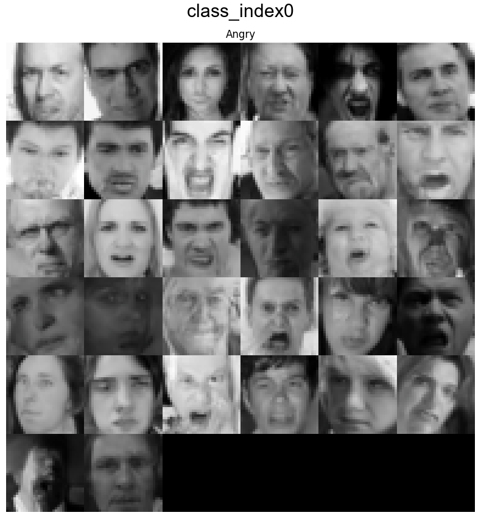
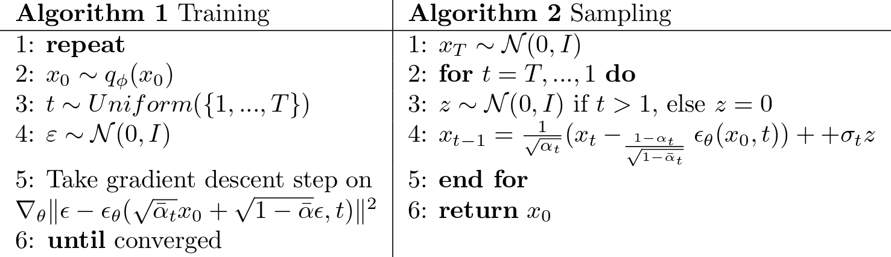

# DDPM with SNR weights for Class conditioned Image generation(with Multi-GPU Support).

Diffusion Models are inspired by Non-equilibrium Thermodynamics. The diffusion model defines a Markov chain of slowing adding Gaussian noise/noise corruption to get an isotropic noise and then learning how to reverse this process to generate new samples. 
DDPM trains a sequence of  models to reverse each step of the noise corruption, using knowledge of the function form of the reverse distributions to make training tractable. There are 3 major components of diffusion models- Corruption Process, UNet to learn to reverse the process, and a Sampler for generating new images. 


# Class Conditioned DDPM with custom Pipeline for Image Generation. (using HuggingFace Diffusers)

The model is based on the Hugging Face unconditional diffusion model training script. But as the name suggests, it didn't have class conditioning support. I modified the script to add class conditioning support. Currently, label names are taken as directory names containing images of the respective class labels. You can easily modify the script for other data formats. Also, make sure to change the num_classes to a number of labels. If you want to modify the class embedding type or make other modifications, see Unet2DModel from diffusers. 
The custom pipeline is used to save images while training, and finally, it can be used to generate specific label images. See the section "Writing Custom Pipeline for conditional image generation"

**FOR FULL IMPLEMENTATION, TRAINING and SAMPLING see train_conditional_tutorial.ipynb**
Please use older accelerate version. There is a resume error if you have the latest version.
```bash
pip install accelerate==0.21.0
```

## Generated Images(training on CIFAR10) 
<div align="center">
    
</div>


## Generated Images(training on FER2013) 

<div align="center">
    
</div>


# DDPM Algorithm



 DDPM Algorithm: Ho et al. (2020)

# How to run training script
Firstly, there are some requirements:-

## Requirements
``` bash
pip install tensorflow
pip install -qq -U diffusers datasets transformers accelerate==0.21.0 ftfy pyarrow==9.0.0
```
and 
``` bash
 pip install git+https://github.com/huggingface/diffusers 
```

You may need to restart kernel after installing these.(In case of Online notebooks it was required.)
## Running Training Script
You also may look through train-conditional-tutorial.ipynb for all these implementation. 
```bash
!git clone https://github.com/KetanMann/Class_Conditioned_Diffusion_Training_Script-MULTI-GPU-/
```
```
cd Class_Conditioned_Diffusion_Training_Script-MULTI-GPU-/
```
Now we can run script:-
``` bash
!accelerate launch --multi_gpu train_conditional.py \
  --dataset_name="/kaggle/input/cifar10-pngs-in-folders/cifar10/train" \
  --resolution=512 \
  --output_dir={model_name} \
  --train_batch_size=1 \
  --dataloader_num_workers=8 \
  --eval_batch_size=1 \
  --num_epochs=2000 \
  --use_ema \
  --gradient_accumulation_steps=4 \
  --learning_rate=5e-5 \
  --lr_warmup_steps=1000 \
  --mixed_precision="no" \
  --save_images_epoch=15 \
  --ddpm_beta_schedule="squaredcos_cap_v2" \
  --checkpointing_steps=2000 \
  --resume_from_checkpoint="latest" \
  --num_classes=10 \
  --prediction_type="sample" \
  --logger="wandb"
```
# Writing Custom Pipeline for Conditional Image generation:-
I wrote my own conditional image DDPM pipeline. You can find it in *conditional_pipeline.py* file. This way you can generate your own class_index image. Here is an implementation of it using CIFAR10 dataset.
For sampling look at *sampling.test*.

# Pretrained Checkpoint
To resume training from checkpoint or inference from pretrained checkpoint, you can download it from here: [https://drive.google.com/file/d/1JpGQQ9VwvPRF4daXMzBqrw9qzTPP6vN9/view?usp=sharing]
Model has been uploaded at HuggingFace Hub and also there are some instructions for sampling: [https://huggingface.co/Ketansomewhere/cifar10_conditional_diffusion1] -> CIFAR10
[https://huggingface.co/Ketansomewhere/FER_2013_Conditional_Diffusion] -> FER 2013


CLass Index for CIFAR10

airplane - index0 

automobile - index1

bird - index2

cat - index3

deer - index4

dog - index5

frog - index6

horse - index7

ship - index8

truck - index9

## For Citation

[](https://zenodo.org/doi/10.5281/zenodo.12600813)


## Useful Links
1.) https://huggingface.co/docs/diffusers/en/tutorials/basic_training

2.) Denoising Diffusion Probabilistic Models (https://arxiv.org/abs/2006.11239) 

3.) Diffusion Models Beat GANs on Image Synthesis (https://arxiv.org/abs/2105.05233) 
