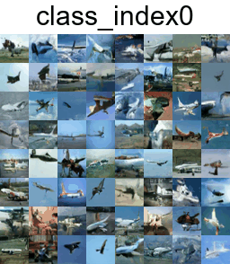

# DDPM with SNR weights for Class conditioned Image generation(with Multi-GPU Support).

Diffusion Model are inspired by Non-equillibrium Thermodynamics. The diffusion model defines a Markov chain of slowing adding Gaussian noise/noise corruption to get an isotropic noise and then learning how to reverse this process to generate new samples. 
DDPM trains a sequence of  models to reverse each step of the noise corruption, using knowledge of the function form of the reverse distributions to make training tractable. There are 3 major components of diffusion models- Corruption Process, UNet to learn reverse process and a Sampler for generating new images. 


# Class Conditioned DDPM with custom Pipeline for Image Generation. (using HuggingFace Diffusers)

Model is based on Hugging face unconditional training script. But as the name suggest it didn't have class conditioning support. I modified the script to add class conditioning support. Currently label names are taken as directory names containing respective class label's images. You can easily modify the script. Also make sure to change the num_classes to number of labels. You modify the class embedding type see Unet2DModel from diffusers. 
The custom pipeline is used to save images while training and finally it can be used to generate specific label images. See section "Writing Custom Pipeline for conditional image generation"

**FOR FULL IMPLEMENTATION, TRAINING and SAMPLING see train_conditional_tutorial.ipynb

# DDPM Algorithm

Below is the table for the DDPM Algorithm from Ho et al. (2020):

| **Algorithm 1** Training | **Algorithm 2** Sampling |
|--------------------------|--------------------------|
| 1: **repeat**            | 1: $x_T \sim \mathcal{N}(0,I)$ |
| 2: $x_0 \sim q_\phi(x_0)$ | 2: **for** $t = T, \ldots, 1$ **do** |
| 3: $t \sim \text{Uniform}(\{1, \ldots, T\})$ | 3: $z \sim \mathcal{N}(0,I)$ if $t > 1$, else $z = 0$ |
| 4: $\varepsilon \sim \mathcal{N}(0,I)$ | 4: $x_{t-1} = \frac{1}{\sqrt{\alpha_t}} \left(x_t - \frac{1- \alpha_{t}}{\sqrt{1-\bar{\alpha}_t}} \epsilon_{\theta}(x_0, t) \right) + \sigma_t z$ |
| 5: Take gradient descent step on $\nabla_{\theta} \| \epsilon -\epsilon_{\theta}(\sqrt{\bar{\alpha}_t} x_{0} + \sqrt{1-\bar{\alpha}_t} \epsilon , t) \|^2$ | 5: **end for** |
| 6: **until** converged | 6: **return** $x_0$ |

**Table**: DDPM Algorithm : Ho et al. (2020)


## Training Hyperparameters are as follows:-  
```bash

dataset_name="/your/dataset/directory" \   # Dataset Folder
resolution=32 \                           # Image Resolution 
output_dir={model_name} \                  # Output Dir 
train_batch_size=64 \                       # Batch Size
dataloader_num_workers=8 \                 # More workers faster loading but more R.A.M. consumption.
# Make  sure  eval_batch_size= train_batch_size
eval_batch_size=64 \                        # Images just for evaluation in logs or save images after specified number of epochs.
num_epochs=2000 \                          # No. of Epochs. Epochs Calculation from step size shown in box.
use_ema \                                  # EMA leads to better convergence and smooth model training.
gradient_accumulation_steps=4 \            # Effective Batch Size = gradient_accumulation_stepss * batch_size (This way Lower VRAM consumption)
learning_rate=1e-4 \                       # Learning Rate
lr_warmup_steps=1000 \                     # LR Warmup steps - have shown better convergence (See learning rate scheduler) 
mixed_precision="no" \                     # fp16's quality was very bad. bf16 is supported by some Nvidia GPU's. If supported please use bf16. Huge GPU memory reduction.
save_images_epoch=50 \                     # After how many epochs images(generated for testing) should be saved.
ddpm_beta_schedule="squaredcos_cap_v2" \   # It was shown by OpenAI that cosine schedulers work better than 'linear'. 
checkpointing_steps=2000 \                 # After how many steps, checkpoints should be saved.(See below to know how to infer number of epochs from checkpoints.)
resume_from_checkpoint="latest" \          # If you want to resume from a given checkpoint (See *Model General Structure.png* for structure). The directory containing 
                                             #this should be named output_dir.
prediction_type="sample" \                 # Default : "epsilon" : Noise Prediction in case DDPM with without SNR.
                                           # SNR weights and SNR loss function used in case of Sample Prediction.(very very crucial).
```


Some other parameters that were set to default are- _model_config_name_or_path, random_flip, adam_beta1, adam_beta2, adam_weight_decay, lr_scheduler, lr_warmup_steps, enable_xformers_memory_efficient_attention, logger, save_model_epochs, mixed_precision, eval_batch_size, num_epochs, use_ema, ddpm_num_steps_. 

# How to run training script
Firstly there are some requirements:-

## Requirements
``` bash
!pip install tensorflow
%pip install -qq -U diffusers datasets transformers accelerate ftfy pyarrow==9.0.0  
```
and 
``` bash
 pip install git+https://github.com/huggingface/diffusers 
 ```
You may need to restart kernel after installing these.(In case of Online notebooks it was required.)
## Running Training Script
You also may look through training_nb.ipynb for all these implementation. 
``` bash
!accelerate launch --multi_gpu train_conditional.py \
    dataset_name="/your/dataset/directory" \  
    resolution=32 \                          
    output_dir={model_name} \                  
    train_batch_size=64 \                      
    dataloader_num_workers=8 \
    # eval_batch_size should be equal to train_batch_size             
    eval_batch_size=64 \                         
    num_epochs=2000 \                          
    use_ema \                                  
    gradient_accumulation_steps=4 \            
    learning_rate=1e-4 \                       
    lr_warmup_steps=1000 \                     
    mixed_precision="no" \                     
    save_images_epoch=50 \                     
    ddpm_beta_schedule="squaredcos_cap_v2" \    
    checkpointing_steps=2000 \                 
    resume_from_checkpoint="latest" \         
    prediction_type="sample"    
```
# Writing Custom Pipeline for Conditional Image generation:-
I wrote my own conditional image DDPM pipeline. You can find it in *conditional_pipeline.py* file. This way you can generate your own class_index image. Here is an implementation of it using CIFAR10 dataset.
For sampling look at *sampling.test*.

# Pretrained Checkpoint
To resume training from checkpoint or inference from pretrained checkpoint, you can download it from here: https://www.kaggle.com/datasets/nyatbleyat/calmness.

Copy to working directory with name {model_name}.




airplane - index0 

automobile - index1

bird - index2

cat - index3

deer - index4

dog - index5

frog - index6

horse - index7

ship - index8

truck - index9


## Useful Links
1.) https://huggingface.co/docs/diffusers/en/tutorials/basic_training

2.) Denoising Diffusion Probabilistic Models (https://arxiv.org/abs/2006.11239) 

3.) Diffusion Models Beat GANs on Image Synthesis (https://arxiv.org/abs/2105.05233) 
